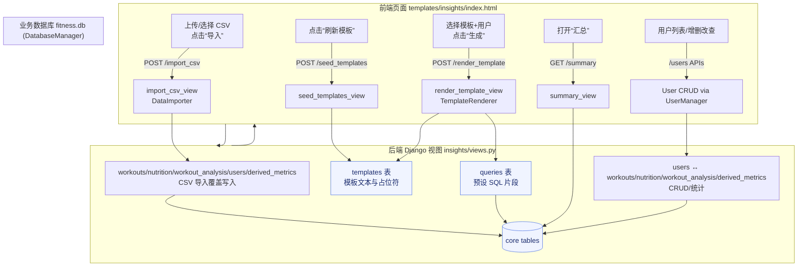

# 健身洞察 Web（Django + SQLite）

专注于 HTML/Web 界面（Django + Tailwind）的健身洞察系统。业务库：`fitness.db`；Django 系统库：`db.sqlite3`（两者分离）。CLI/GUI 已移除，全部功能通过浏览器完成。

## 快速启动（仅 Web 界面）
1) 准备环境
   ```bash
   python3 -m venv .venv
   source .venv/bin/activate
   pip install -r requirements.txt
   ```

2) 清理并创建数据库（空库启动）
   ```bash
   rm -f fitness.db db.sqlite3
   python manage.py migrate  # 仅创建 Django 系统表到 db.sqlite3
   ```

3) 导入业务数据到 fitness.db（确保 CSV 在根目录，如 Final_data (1).csv）
   ```bash
   python - <<'PY'
   from database import DatabaseManager
   from templates import seed_templates
   from importer import DataImporter
   db = DatabaseManager("fitness.db")
   db.create_tables()
   seed_templates(db)
   DataImporter(db).import_csv("Final_data (1).csv", clear_existing=True)
   print("users rows:", db.execute("SELECT COUNT(*) AS c FROM users", fetchone=True)["c"])
   db.close()
   PY
   ```

4) 启动 Web 前端
   ```bash
   python manage.py runserver  # 默认 http://127.0.0.1:8000
   ```
   - 页面功能：刷新模板、导入 CSV、选择用户、渲染模板、查看汇总

## 主要文件（Web-only）
- fitness_site/settings.py：Django 配置（系统库 db.sqlite3）
- insights/views.py / insights/urls.py：接口与路由（使用 fitness.db）
- templates/insights/index.html：前端界面（Tailwind CDN）
- database.py：业务 SQLite schema/连接
- importer.py：CSV 导入到业务表
- renderer.py：模板渲染（占位符 → SQL）
- templates.py：默认模板及 seed（运行时写入 templates 表）
- user_manager.py：用户管理服务，供 Web 端接口调用

## 备注
- 仅保留 Web 前端入口。
- 重置模板可在页面点击“刷新模板”或调用 `seed_templates(db)`。


